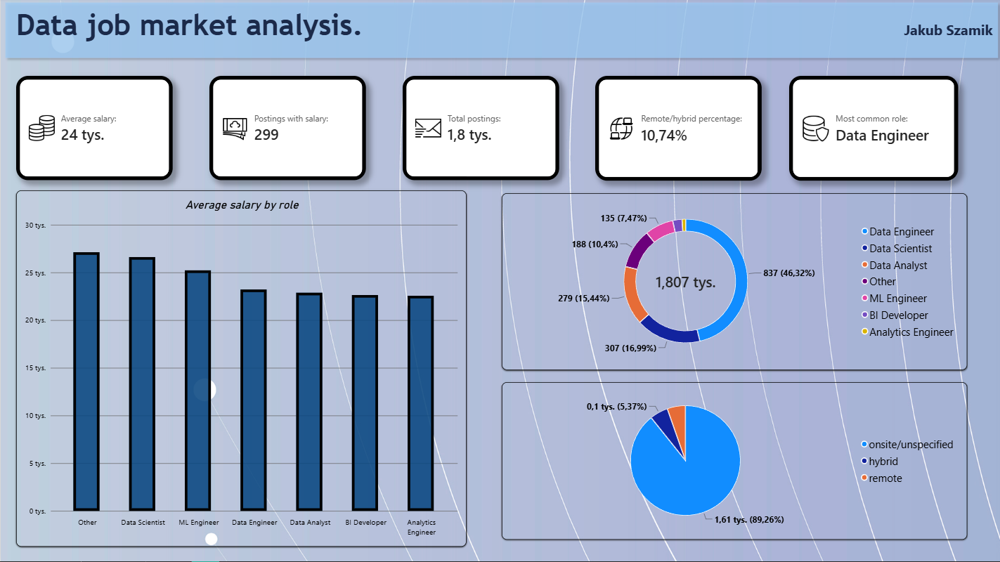
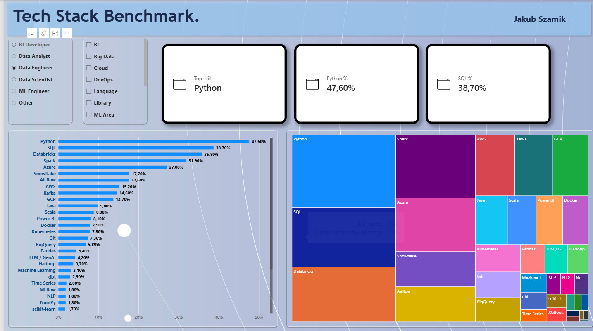

# Data Job Market Analysis (Poland)

I wanted to know what the Polish data job market looks like in practice: which roles dominate, what they pay, and which tools you actually need for each of them. This project answers that with real job postings.

The data comes from the Adzuna API. A Python script cleans it, loads it into a SQLite star schema, a set of SQL views feeds the numbers, and the final result is a two-page Power BI dashboard.


## Dashboard

**Overview** shows the main KPIs, the split of postings by role, average salary by role and how many postings mention a work mode.



**Tech Stack Benchmark** lets you pick a role and a skill category and shows how often each skill appears in that role's postings.



## What I found

The dataset has 1,807 postings from 532 companies in 45 locations. Only 299 of them (about 16.5%) contain a real salary range, and those average roughly 24,300 PLN gross per month. Data Engineer is the most common role by a wide margin, with 837 postings (46%).

For Data Engineer postings, Python appears in 47.6% of them and SQL in 38.7%. Databricks (35.8%), Spark (31.9%) and Azure (27.0%) come next. Azure shows up noticeably more often than AWS or GCP in this sample.

Only about 11% of postings mention remote or hybrid work, but that number is a lower bound. Most postings simply don't say anything about work mode, and I label those as unspecified.

## How it works

```
Adzuna API -> job_pipeline.py -> CSV -> load_to_db.py -> SQLite -> SQL views -> CSV -> Power BI
```

### job_pipeline.py

It queries Adzuna for six phrases (data analyst, data engineer, analytics engineer, bi developer, data scientist, machine learning engineer), with retries and backoff, and saves the raw responses to a dated JSON file.

Then it cleans the data:

- Salaries are converted to monthly PLN. If Adzuna only gives its own predicted salary, I leave the field empty rather than mix estimates with real ranges. Values outside 2,000 to 100,000 PLN per month are treated as errors and dropped.
- Roles are assigned from the job title with ordered regex rules, where the first match wins. Anything that doesn't match ends up as "Other".
- Skills are extracted from title and description with a dictionary of about 45 skills in 12 categories. The patterns use lookarounds instead of word boundaries, because `\b` breaks on things like C++ and .NET.
- Work mode (remote, hybrid or unspecified) is detected in both English and Polish.

### load_to_db.py

It rebuilds the SQLite database from the CSV files on every run, so the CSVs are the source of truth. The schema is a star schema: one fact table with postings, dimensions for date, company, location and role, and a bridge table between postings and skills, since one posting needs many skills.

### SQL views

All dashboard numbers come from views in `sql/02_views.sql`:

| View | Used for |
|---|---|
| `v_overview` | KPI cards |
| `v_work_mode` | work mode split |
| `v_salary_by_role` | postings, salary coverage and average salary per role |
| `v_salary_by_skill` | average, min and max salary per skill and role |
| `v_skill_demand_by_role` | share of a role's postings that mention each skill |
| `v_postings_skills_flat` | flat posting by skill table for ad hoc analysis |

Salary metrics use real ranges only (`salary_is_predicted = 0`).

## Running it yourself

```bash
git clone <repo-url>
cd <repo>
pip install -r requirements.txt
```

Get a free API key at developer.adzuna.com and create a `.env` file (see `.env.example`):

```
ADZUNA_APP_ID=your_app_id
ADZUNA_APP_KEY=your_app_key
```

Then run:

```bash
python job_pipeline.py --pages 3
python load_to_db.py
```

The CSVs and `jobs.db` end up in `data/`, and the view exports in `data/tableau/` (the folder name is a leftover, the files load into Power BI just fine).

## Project structure

```
job_pipeline.py          API, cleaning, CSV
load_to_db.py            CSV, SQLite star schema, views, exports
sql/01_schema.sql        tables, keys, indexes
sql/02_views.sql         analytical views
data/                    CSVs, database, view exports
images/                  dashboard screenshots
JobMarketAnalysis.pbix   Power BI report
```

## Limitations

- Salary data is thin. With 299 salaries, averages are rough, and for small roles like Analytics Engineer (4 salaries) they mean very little.
- Role and skill detection is rule-based, not ML, so some postings get misclassified.
- Work mode is detected from text, so the remote and hybrid share is underestimated.
- Everything comes from one source, Adzuna, so this reflects what that site lists and not the whole market.

## Possible next steps

A scheduled refresh to track demand over time, a salary calculator based on `v_salary_by_skill`, and more sources such as justjoin.it or No Fluff Jobs.

## Author

Jakub Szamik
